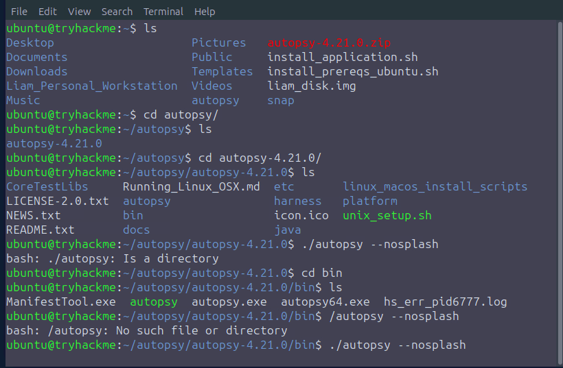
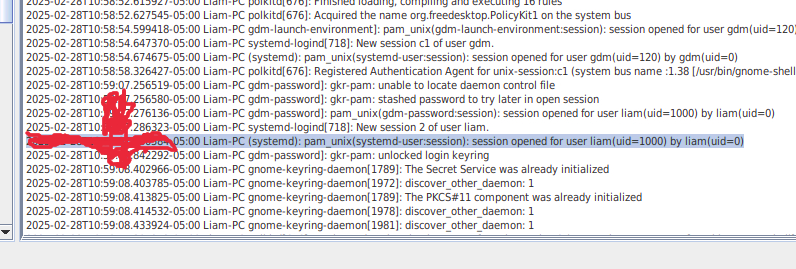
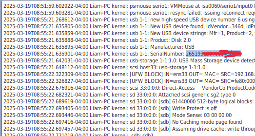
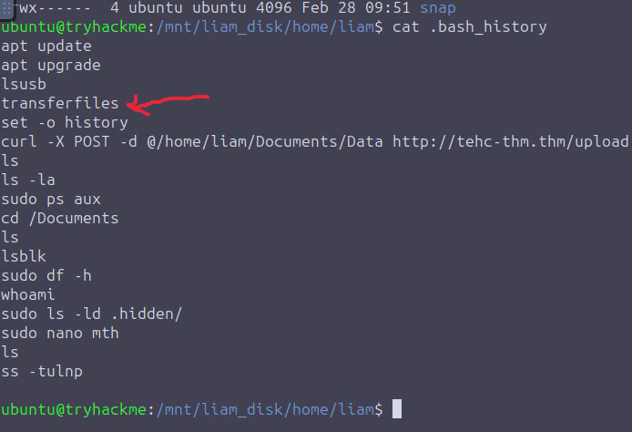
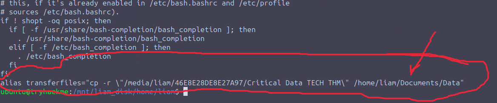
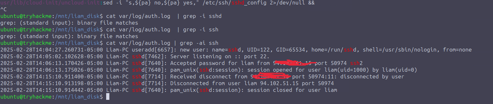

# ExfilNode-Write-up

Type: Forensics \
Level: Medium\
Points: 420

### Scenario

The analysis of Liam's company-provided Windows workstation in the DiskFiltration room revealed major evidence of his involvement in the TECH THM's data exfiltration. However, he could argue that he was framed as he did not own the workstation. So, to uncover the whole truth and gather all the possible undeniable evidence, the investigators turned their attention to Liam's personal workstation (Linux machine), which was suspected to have played a key role in handling the exfiltrated data.

As this was Liam's personal workstation, he had full control over covering his tracks more effectively. But was he careful enough? It seems like the investigators not only revealed more about the external entity Liam worked with but also exposed a betrayal: Liam was double-crossed.

### Starting the Machine

Let’s start the virtual machine by pressing the **Start Machine** button below. The machine will start in split view.

Start Machine

In case the VM is not visible, use the blue **Show Split View** button at the top of the page.

Liam's personal workstation's disk is mounted at `/mnt/liam_disk`, and the disk image is available at `/home/ubuntu`. You can run commands on the mounted disk.

**Note:** If you get the error `grep: /mnt/liam_disk/var/log/auth.log: binary file matches` with any log file, use `grep -a` which will treat the file as text. An example is given below:

`grep -i -a "string-pattern" /mnt/liam_disk/var/log/auth.log`

Additionally, you can utilize the Autopsy tool to assist with the analysis. However, Autopsy is optional. All the questions in this room can be answered by running commands on the mounted disk.

To use Autopsy, open a terminal and navigate to `/home/ubuntu/autopsy/autopsy-4.21.0/bin` and execute the command `./autopsy --nosplash` to execute it. The GUI of the tool will open. Now, select `Open Recent Case` from here and open the recent case named `Liam_Personal_Workstation` in which we have already imported the disk image.&#x20;


If Open Recent Case is Desabled then just click on open case, then go to `/home/ubuntu/Liam_Personal_Workstation/`then select `*.aut` file and open it


<figure><figcaption>
opening autopsy
</figcaption></figure>

It will look something like\

<figure><figcaption>
Home page of the case
</figcaption></figure>

## Task 1 The End

### Q1: When did Liam last logged into the system? (Format: YYYY-MM-DD HH:MM:SS)

we go to volume5/var/log and found the time of session open through GUI


**gdm-password** indicates login via the GUI (GNOME Display Manager).


<figure><figcaption></figcaption></figure>

Answer: 2025-02-28 #:#:#

### Q2: What was the timezone of Liam’s device?

for this i just googled it time of session and i got the timezone `America/Toronto`Etc/UTC or you can look at`/etc/timezone`

<figure><figcaption></figcaption></figure>

### Q3: What is the serial number of the USB that was inserted by Liam?

we will look in `var/log/kern.log`

The only USB log was there at the time when liam was logged into the system

<figure><figcaption>
USB serial No.
</figcaption></figure>

### Q4: When was the USB connected to the system? (Format: YYYY-MM-DD HH:MM:SS)

for this i executed this cmd `cat syslog | grep usb`

<figure><figcaption>
Time of incertion 
</figcaption></figure>

And we got the time  **2025-02-28T10:59:25.473132-05:00**

### **Q5:** What command was executed when Liam ran 'transferfiles'?

For this we can try diff approach to find like first we need to see in .

<figure><figcaption></figcaption></figure>

Here we can see hi executed <mark style="color:purple;">transferfiles</mark> It's an alies so we need to look it on some other files specially in .bashrc&#x20;

<figure><figcaption></figcaption></figure>

and we got it `cp -r "/media/liam/46E8E28DE8E27A97/Critical Data TECH THM" /home/liam/Documents/Data`

### Q6: What command did Liam execute to transfer the exfiltrated files to an external server?

This was very easy as it can be found directly in the .bash\_history

<figure><figcaption>
transfer file to C2
</figcaption></figure>

### Q7: What is the IP address of the domain to which Liam transferred the files to?

this was also easy we know the site is `http://tehc-thm.thm` but its not in the DNS on when you ping or search on browser you won't get anything, so wi will simply look at the `/etc/hosts` to see what ip has mapped with this url\
Cmd: `cat etc/hosts`

<figure><figcaption></figcaption></figure>

### Q8: Which directory was the user in when they created the file 'mth'?

For this we will look the .bash\_history and we see that before  `sudo nano mth` ,  he listed a file .hidden/ which means he as in home directory becase that folder is in home so the curr directory will be the directory where he created mth which is `/home/liam`

<figure><figcaption></figcaption></figure>

### Q8: Remember Henry, the external entity helping Liam during the exfiltration? What was the amount in USD that Henry had to give Liam for this exfiltration task?

This is very straight forward as we need to just open the file mth, we'll get the amount there.

<figure><figcaption></figcaption></figure>

### Q9: When was the USB disconnected by Liam? (Format: YYYY-MM-DD HH:MM:SS)

Remeber in  [#q4-when-was-the-usb-connected-to-the-system-format-yyyy-mm-dd-hh-mm-ss](exfilnode-write-up.md#q4-when-was-the-usb-connected-to-the-system-format-yyyy-mm-dd-hh-mm-ss "mention") we see the time of connection of that usb just cat that output again and some line below you will find something `2025-02-28T11:44:00.456653-05:00 Liam-PC kernel: usb 1-1: USB disconnect, device number 2`

<figure><figcaption></figcaption></figure>

### Q10: There is a .hidden/ folder that Liam listed the contents of in his commands. What is the full path of this directory?

lest see what is in the /home/liam/.hidden

<figure><figcaption>
content in .hidden folder
</figcaption></figure>

upssss..! this folder is empty sure he have created in somewhere else lets find out\
We run cmd find to find the dir `find /mnt/liam_disk/ -type d -name ".hidden" 2>/dev/null` \
and we get 2 DIRs, so it must be the second one&#x20;

<figure><figcaption>
dir found
</figcaption></figure>

### Q11: which files are likely timstomped in this .hidden/ directory (answer in alphabetical order, ascending, separated by a comma. e.g example1.txt,example2.txt)

### Step-by-Step Breakdown of the Question:

#### ❓**What is being asked?**

You need to:

1. Look at the files in the `.hidden/` directory.
2. Analyze their **timestamps** (created, modified, accessed).
3. Identify **which ones look suspicious**, as if someone **faked or manipulated** the time values.
4. Return the filenames that are **likely timestomped**.
5. Sort the filenames in **alphabetical order (A–Z)**.
6. Output as:\
   `example1.txt,example2.txt`

### 🧪 What does **"timestomped"** look like in practice?

You’re looking for anomalies like:

* Files with **created dates far in the past** (e.g., 1970, 1980)
* Files where **modified is before created**
* Files whose timestamps are **very different** from all other files in the directory
* Files that have **identical timestamps** in all fields, which is uncommon
* Files that were **created before the system was even installed**

<figure><figcaption></figcaption></figure>

We see file3 and file7 do not have time in hh:mm so it is suspecious, and our answer too..!

### Q 12: Liam thought the work was done, but the external entity had other plans. Which IP address was connected via SSH to Liam's machine a few hours after the exfiltration?

so for this quesiton we will look again in var/log/auth.log  to see ip using grep\
CMD: `cat var/log/auth.log | grep -ai ssh` and we can see the ip with `94.xxx.xx.xx`&#x20;

<figure><figcaption></figcaption></figure>

### Q12: Which cronjob did the external entity set up inside Liam’s machine?

Lets see the crontab: but no cronjob found CMD: `cat etc/crontab`

<figure><figcaption></figcaption></figure>

Lets see the next one, CMD sudo cat var/spool/cron/crontabs/liam and we found it in the very last line

<figure><figcaption>
found it
</figcaption></figure>

Whooo...! And this is how we solve this challenge! 🎉
